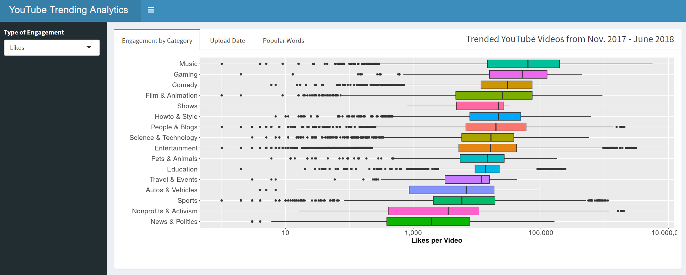
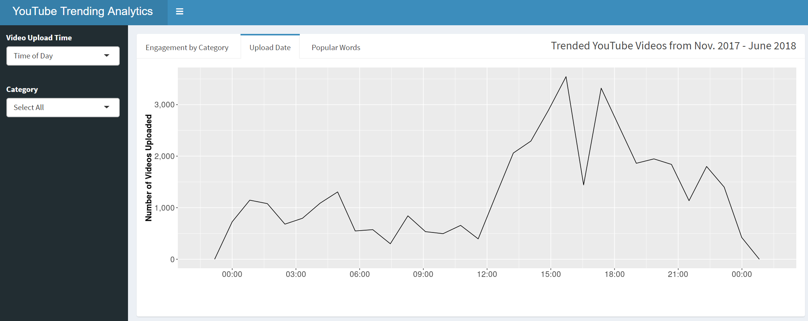
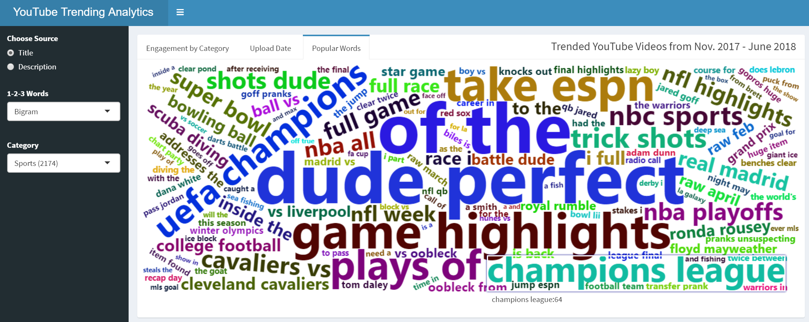

# YouTube Trending Analytics

**Collaborators:** [Jim Pushor](https://github.com/jpush1773), [Jack Yang](https://github.com/jackattackyang)

#### [Deployed Shiny App](https://jackattackyang.shinyapps.io/dsci532_youtube-trending/)

## Overview
Youtube trending information may not only be interesting to look at but also impactful in making decisions for those individuals or businesses looking to grow a bigger audience. This app analyzes [this Kaggle dataset](https://www.kaggle.com/datasnaek/youtube-new) containing information on trending YouTube videos from Nov. 2017 - June 2018. The hope is to create an interactive environment for aspiring content creators to gain insight into what it takes for a video to land on the homepage of YouTube. "Likes", "Dislikes", most frequent upload times, and popular title choices are available by category amongst other options, allowing users to make informed decisions on how to improve their viewership.

## Design

