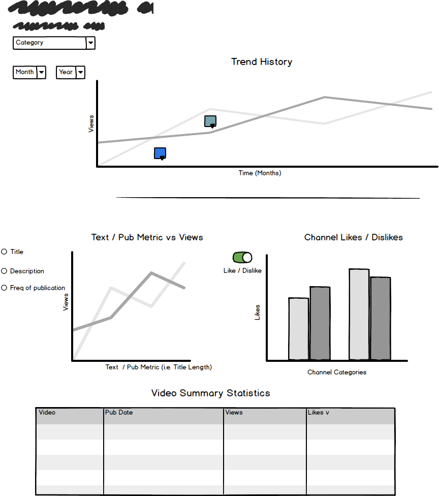

## DSCI 532 Data Visualization II &#151; Milestone I
**Date:** 2019-01-12 
**Collaborators:** Jim Pushor, Jack Yang

### Section 1: Overview

Youtube trending information may not only be interesting to look at but also impactful in making decisions for those individuals or businesses trying to have an serve a purpose. This can take the form of growing your customer base as a business or in the case of a content creator, generating more views and likes to satisfy a personal interest (i.e. education, notoriety, self-marketing or sharing ideology). In either case, you need to approach publication of content strategically. Good video production happens on a fast pace, so any leg-up that a content creator can find is critical. Content creators often seek out like-minded individuals and mimic strategy to further their cause. Creativity is often born from creativity, or in other words: learn from the best.  Trending websites in all categories take on many strategies to promote their videos, doing anything possible to separate themselves from the masses of content creators on YouTube; however, it is true that the top producers are also consistent. This consistency is what we want to bring to the surface for the content creator.

We have identified that though there are many examples of trending videos, many content providers would benefit from learning from the patterns of those content creators that rise above. Yes, it is hard to measure creativity, but data analysis of the top trending videos may provide insight that a content creator can use to help develop a more exciting platform which fosters greater interest. We will be developing an app that content creators can use to gain insight into patterns of success from other creators. They will be able to customize the settings in the app to bring important information to the surface. For example, title and description content is a very important feature of a channel and video and this app will provide useful analysis that will solve the problem of, "How should I publish my videos to help in my efforts in gaining more views?".

### Section 2: Description of the Data

The ["Trending Youtube Video Statistics"](https://www.kaggle.com/datasnaek/youtube-new) dataset is a public domain dataset from Kaggle. We will be visualizing various statistics of over 40,000 trending videos in the US from November of 2017 to June of 2018.

A channel's popularity will be analyzed in terms of the number of times it has trended, views, likes, dislikes and comments. A similar analysis will be conducted for the different categories. Some text analysis will be conducted for the title and description to determine the average lengths, commonly used words and capitalization amongst other title characteristics that would make a trending Youtube video. A timeline of the videos will also be plotted by upload date to determine trends in time.

### Section 3: Usage Scenario

Rebecca is an up-and-coming content creator on Youtube who makes slice of life videos. She has a consistent fan base of around a few hundred viewers. She would like to grow a bigger audience but has no clue on how to create a viral video. When she accesses the "Trend Now" app, she is greeted by summary statistics (likes, views, dislikes) about the trending videos. She can select the most relevant category to help her gauge the expected amount of engagement needed for a frontpage video. She can toggle the most popular channels in her category in order to scope out her competition. Information on the most popular naming conventions for title and descriptions will also be available to help her curate a viral headline. Lastly, video submission times broken down by time of day, day of week and day of the month to help inform Rebecca what is the best time to upload her videos for the most engagement.

### Section 4: Description of the App & Sketch

This Shiny App, "Trend Now" has one main landing page that is divided into three main sections. On the left is a panel where a user can select specific criteria to isolate the videos by category of interest and by time. For example, a user can filter the dataset by category (i.e. sports, entertainment) and select specific months (for season interests). On the right top portion of the page will be a line graph depicting a profile of the video's performance relative to popularity and time with the average performance of the category in the background. We feel that the app needs to do more than show a high-level view of video history, so on the bottom pane, we will introduce a deeper dive into some of the characteristics of the trending videos that a content creator can use in their own.  Title and description metrics and patterns of publication will be offered as plots. These plots will be supplemented with a table that provides a quantitative summary of key data. The user can study word usage frequency and length of title and description submission to determine the optimal length. A user can switch criteria to suit their needs with the use of radio and toggle buttons.

